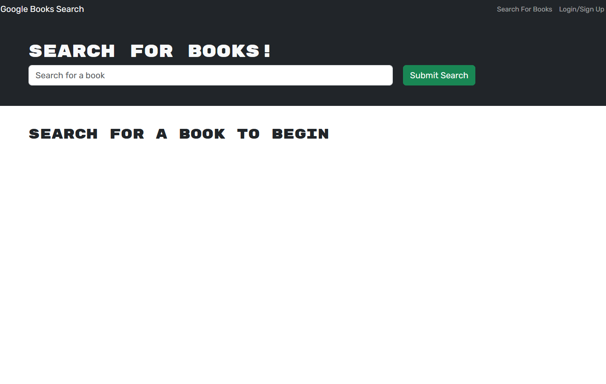

# BookSearch

## Description

This BookSearch app was refactored into graphQL and Apollo from the initial use of express and mongoose. The application allows a user to search for and save books from the google api. This project taught me how to use GraphQL and Apollo to run CRUD operations on the database.

## Table of Contents

- [Installation](#installation)
- [Usage](#usage)
- [Technologies](#technologies)
- [License](#license)
- [Contributors](#contributors)
- [Contributing](#contributing)
- [Questions](#questions)

## Installation

No installation is required to view this project. Simply navigate to the deployed [Web Application](https://protected-sands-84264-cf7c77ed4f11.herokuapp.com/) 

## Usage

To use the BookSearch, follow these simple steps:

1. Navigate to the deployed Web Application
2. Sign up or login to the application
3. Search for your favorite books and save them to your collection

## Technologies

The Dev Portfolio project utilizes the following technologies:

- [React](https://reactjs.org)
- [Node.js](https://nodejs.org/en)
- [Express.js](https://expressjs.com/)
- [GraphQL](https://graphql.org/)
- [Apollo Server](https://www.apollographql.com/)
- [MongoDB](https://www.mongodb.com/)

## License

The BookSearch project is licensed under the MIT License. See the [LICENSE](LICENSE) file for more details.

## Contributors

- [Joshua Bott](https://github.com/josh4got)

## Contributing

If you would like to contribute to this project or have any suggestions, please feel contact me via the questions section of the readme

## Questions

If you have any questions or would like to get in touch, please feel free to email me at [joshbottied1@gmail.com](mailto:joshbottied1@gmail.com).